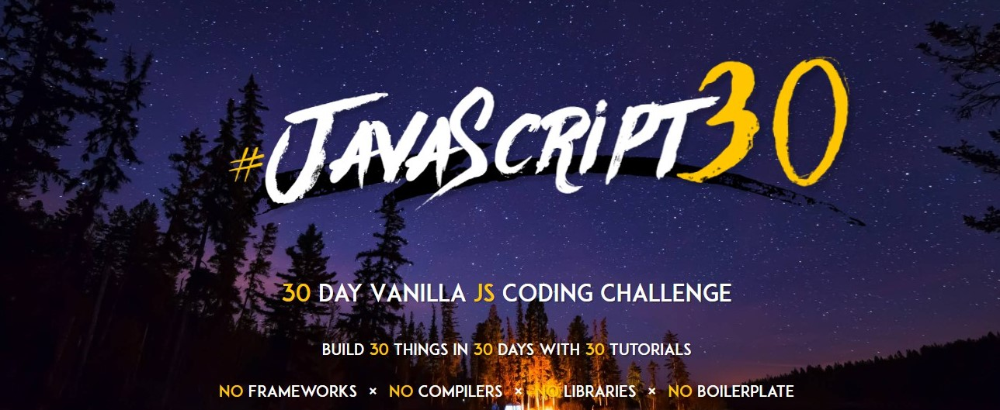

# JavaScript30
> Coding challenge with JavaScript30 course by wesbos

Hello, world!

This repository was created to keep me motivated and documenting my journey on JavaScript30 course by wesbos. I will add some notes to this readme based on what I have learnt on this course after I finished the task on that day.

Happy coding!

## Notes
### Day 01: Jul 1, 2019
I have just learned how to interact with DOM with querySelector, how to handle key event with addEventListener, add some CSS class with javascript, and transition effect on CSS. I also add feature which drum kit can hit not only by keyboard but also with mouse click. Cool!

**Live Demo**: enjoy the drum kit [here](https://alrafi.github.io/javascript30/Day%2001%20-%20Javascript%20Drum%20Kit/).

### Day 02: Jul 10, 2019
On this challenge, I just learned how to animate an element with transform and transition property on CSS. With javascript, we made the clock rotate realtime based on time right now. We also use setInterval() to make our function run every second. Love this course and still curious with all the rest of the challenges.

**Live demo**: please check the clock [here](https://alrafi.github.io/javascript30/Day%2002%20-%20JS%20Clock/).

### Day 03: Jul 21, 2019
On this project, I have learned how to use CSS variables and how to modify these variables with javascript. Besides that, I also learned how to use input type range and color in our HTML input. So cool!

**Live demo**: explore the [CSS Variables here](https://alrafi.github.io/javascript30/Day%2003%20-%20CSS%20Variables/).
